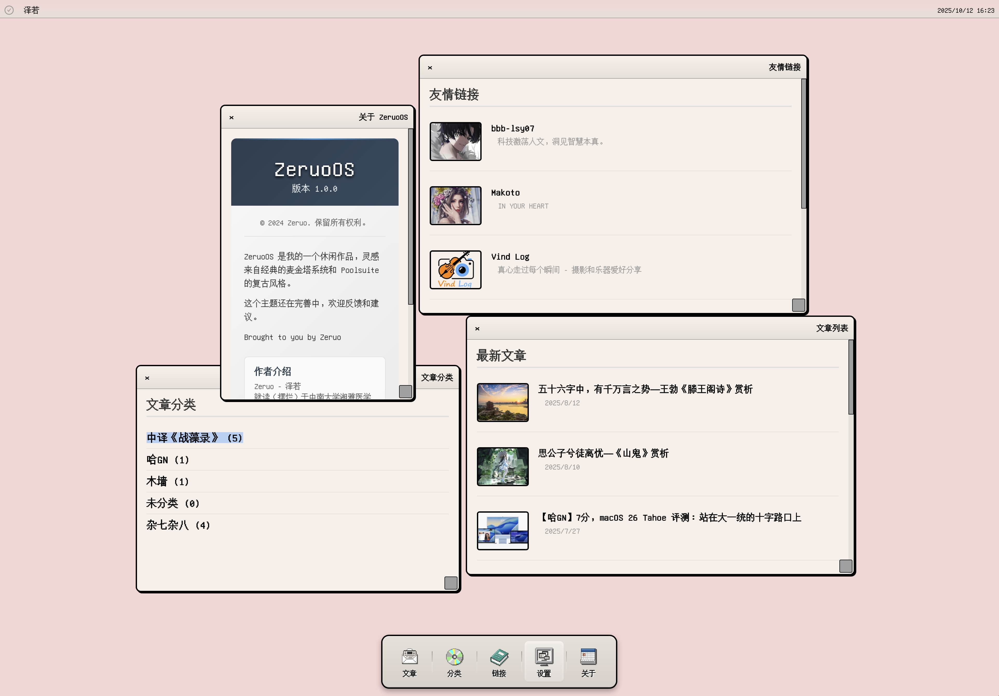

[](https://github.com/ZeruoChen/ZeruoOS)

<h1 align="left">ZeruoOS WordPress Theme</h1>

> 一款复刻经典麦金塔系统界面的 WordPress 主题，怀旧、简洁、功能实用、体验独特。

[](https://github.com/ZeruoChen/ZeruoOS/releases/latest)
[](https://github.com/ZeruoChen/ZeruoOS/releases)

[](https://wordpress.org/)


## 主题预览：

[](screenshot.jpg)

## 下载及使用相关：

- 你可以前往 [Github Release](https://github.com/ZeruoChen/ZeruoOS/releases/latest) 下载最新版本

- 使用 WordPress 后台主题上传功能进行安装

- 主题演示：查看 `demo.html` 文件了解主题效果

- 主题交流：[GitHub Issues](https://github.com/ZeruoChen/ZeruoOS/issues) 提交问题或建议

- 如果在使用过程中遇到了任何问题，请先查看主题文件中的说明文档

- 在确认你遇到的现象确实是一个 Bug 后，请在 [Issues](https://github.com/ZeruoChen/ZeruoOS/issues/new/choose) 提交问题，并为该问题尽可能的描述清楚，谢谢配合。

## 功能特性：

### 🖥️ 经典桌面界面
- 复刻麦金塔经典系统界面风格
- 拟物化设计元素和怀旧配色
- 像素风格图标和字体渲染

### 🪟 窗口管理系统
- 可拖拽、缩放、最小化的窗口
- 多窗口层叠管理
- 窗口状态记忆功能

### 🚀 程序坞功能
- Poolsuite 风格程序坞设计
- 立体感按钮和分隔效果
- 平滑的交互动画

### 📱 响应式设计
- 适配不同屏幕尺寸
- 移动端友好界面

## 安装方法：

### 方法一：WordPress 后台安装
1. 下载主题 ZIP 文件
2. 进入 WordPress 后台 → 外观 → 主题
3. 点击"上传主题"并选择 ZIP 文件
4. 激活主题

### 方法二：手动安装
1. 解压主题文件到 `/wp-content/themes/` 目录
2. 在 WordPress 后台激活主题

## 文件结构：

```
Theme/
├── index.php              # 主题主文件
├── header.php             # 头部模板
├── footer.php             # 底部模板
├── functions.php          # 功能函数
├── style.css              # 样式文件
├── js/
│   └── window-manager.js  # 窗口管理脚本
├── Poolsuite/
│   └── dock/              # 程序坞图标资源
├── screenshot.jpg         # 主题截图
└── README.md             # 说明文档
```

## 窗口系统
- 基于原生 JavaScript 的窗口管理器
- 事件驱动的交互逻辑
- 状态持久化存储

## 浏览器兼容性：

- ✅ Chrome 60+
- ✅ Firefox 55+
- ✅ Safari 12+
- ✅ Edge 79+

## 自定义开发：

### 添加新窗口类型
```javascript
// 在 window-manager.js 中添加新窗口类型
const newWindow = {
    id: 'custom-window',
    title: '自定义窗口',
    content: '<div>自定义内容</div>',
    width: 600,
    height: 400
};
```

### 样式定制
```css
/* 在 style.css 中覆盖默认样式 */
.dock-button {
    background: linear-gradient(135deg, #your-color 0%, #your-color2 100%);
}
```

## 设计资源：

- 程序坞图标基于 Poolsuite 风格设计
- 麦金塔经典界面元素参考
- 像素艺术风格图标

## 开源协议：

本主题基于 [GPL v2.0](LICENSE) 协议开源。

## 支持与反馈：

如果你在使用过程中遇到问题或有改进建议，欢迎通过以下方式联系我们：

- 📧 邮件支持：提交到 GitHub Issues
- 💬 问题反馈：[GitHub Issues](https://github.com/ZeruoChen/ZeruoOS/issues)
- 🔧 功能请求：通过 Issues 提交

## 更新日志：

### v1.0.0 (当前版本)
- ✅ 基础主题框架搭建
- ✅ 麦金塔经典界面实现
- ✅ 窗口管理系统完成
- ✅ Poolsuite 风格程序坞
- ✅ 响应式设计适配

## 希望你喜欢这款主题！

- Star 趋势  [](https://github.com/ZeruoChen/ZeruoOS/stargazers)

[](https://github.com/ZeruoChen/ZeruoOS/stargazers)
